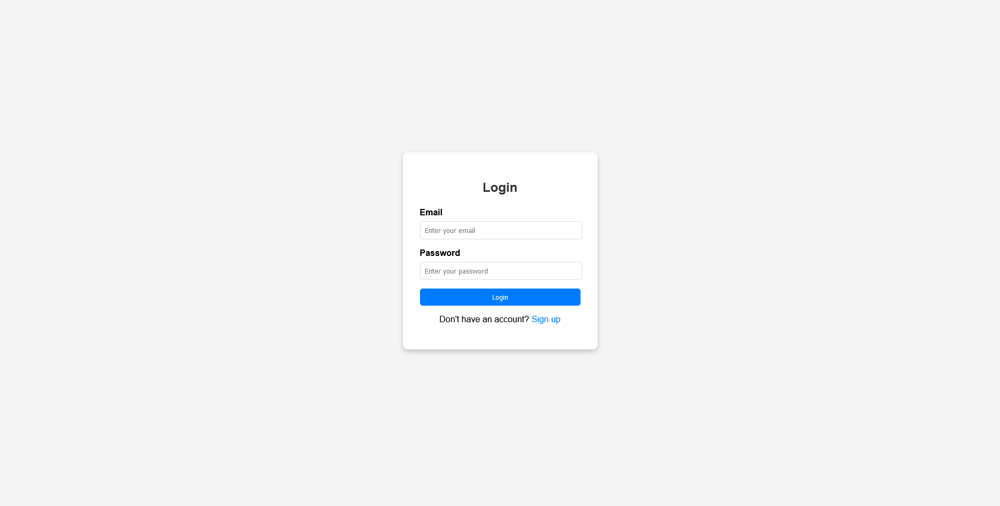

# Auth-App

Authentication app with signup and login and logout functionalities.

## Table of contents

- [Overview](#overview)
  - [Screenshot](#screenshot)
  - [Built with](#built-with)

## Overview

Built frontend using React js, CSS, backend using Node js and Express framework, maintained db using mySQL.Tools used are mySQL Workbench for storage and postman for API testing and visual studio code as IDE.

### Screenshot

### Built with

- React js
- CSS
- Node js
- mySQL

###

npm start command to run the application
node server.js to run the server

### DB schema

CREATE DATABASE user_auth;
USE user_auth;
CREATE TABLE users (
id INT AUTO_INCREMENT PRIMARY KEY,
email VARCHAR(255) UNIQUE NOT NULL,
password VARCHAR(255) NOT NULL
);
